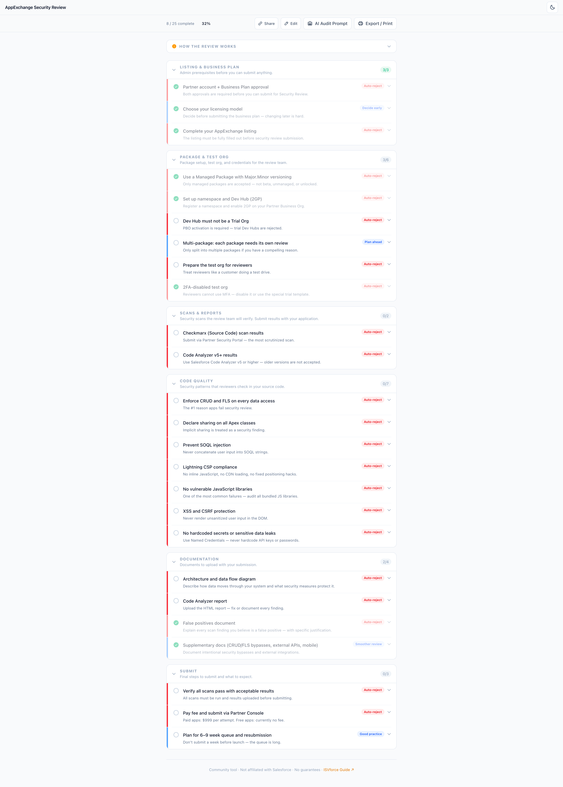

<h1> AppExchange Security Review Checklist</h1>

An interactive, open-source checklist to help Salesforce ISV partners prepare for the AppExchange Security Review. Built as a modern replacement for the now-defunct [checklistbuilder.herokuapp.com](https://checklistbuilder.herokuapp.com/).



## Why this exists

The AppExchange Security Review is the biggest hurdle for ISV partners listing on AppExchange. The process is long (6–9 weeks), expensive ($999/attempt for paid apps), and the requirements are scattered across dozens of Salesforce docs.

This tool consolidates everything into one interactive checklist — tailored to your specific app type — so you can prepare thoroughly and pass on your first attempt.

## Features

- **Wizard**: Select your app type (managed package, web app, mobile, etc.) to generate a tailored checklist
- **50+ checklist items** across 9 categories, each with descriptions, pro tips, doc links, and code examples
- **Severity indicators**: Critical, Important, Recommended, and Nice-to-have badges
- **Progress tracking**: Overall and per-category completion percentage
- **localStorage persistence**: Your progress is saved between sessions
- **Dark/light mode**: Automatic system preference detection with manual toggle
- **Shareable URLs**: Share your progress with colleagues via encoded URL
- **AI audit prompt**: Generate a ready-to-paste prompt for LLM code review
- **Export/Print**: Clean print stylesheet for PDF export
- **Fully offline**: No external API calls — works completely offline after first load
- **Process explainer**: "How the review works" panel explaining the 4 stages of security review

## Getting started

```bash
npm install
npm run dev
```

Open [http://localhost:3000](http://localhost:3000).

## Tech stack

- Next.js 16 (App Router)
- TypeScript
- Tailwind CSS
- @phosphor-icons/react
- No database, no auth — fully static/client-side

## How to contribute

The checklist data lives in `data/checklist.ts`. To add or update items:

1. Fork this repo
2. Edit `data/checklist.ts` — each item has an `id`, `category`, `title`, `description`, `severity`, and optional fields like `tip`, `docUrl`, `codeExample`, and `appTypes`
3. Submit a PR with a description of what changed and why

See [CONTRIBUTING.md](CONTRIBUTING.md) for detailed guidelines.

## Data sources

- [ISVforce Guide](https://developer.salesforce.com/docs/atlas.en-us.packagingGuide.meta/packagingGuide/) — Official Salesforce packaging guide
- [Salesforce Security Review Guide](https://developer.salesforce.com/docs/atlas.en-us.packagingGuide.meta/packagingGuide/security_review_overview.htm)
- [Salesforce Code Analyzer](https://forcedotcom.github.io/sfdx-scanner/)
- [Trailhead: ISV Security Review](https://trailhead.salesforce.com/content/learn/modules/isv-security-review)
- Community experience from ISV partners who have gone through the process

## Disclaimer

This is a community tool built by Salesforce ISV partners. It is **not** affiliated with, endorsed by, or maintained by Salesforce, Inc. Requirements change over time. Always verify against the [official ISVforce Guide](https://developer.salesforce.com/docs/atlas.en-us.packagingGuide.meta/packagingGuide/).

## License

MIT
